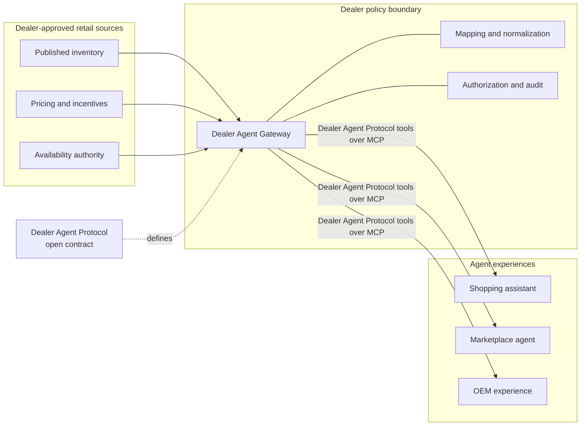
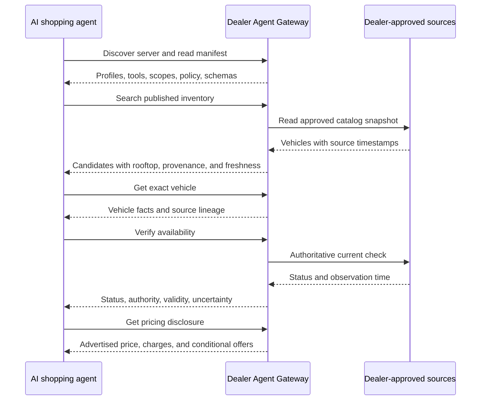
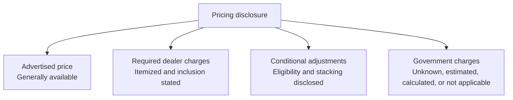
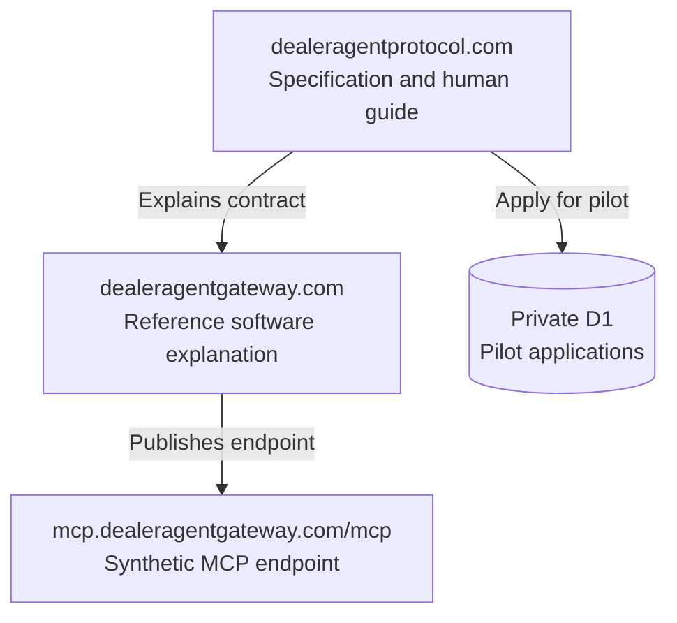
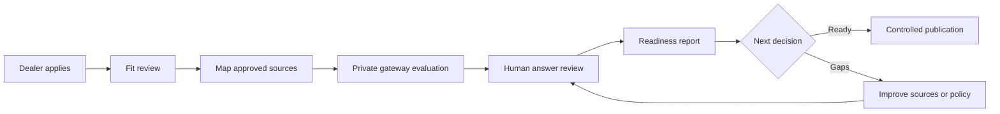

# Dealer Agent Protocol

**Complete project brief**  
**Status date:** September 2, 2026  
**Current version:** `0.1.0-draft.1`  
**Status:** Editor’s draft  
**Creator:** Ariel Coro  
**License:** Apache License 2.0

> Dealer Agent Protocol is an open, dealer-controlled contract that gives AI agents a precise way to understand dealer-published vehicles, authoritative availability, advertised prices, required dealer charges, discounts, rebates, incentives, freshness, provenance, and uncertainty.

This document is the human-readable master brief for the project. The versioned specification, capability catalog, schemas, and conformance requirements remain the normative sources of truth.

## Public project surfaces

| Surface | URL | Purpose |
|---|---|---|
| Dealer Agent Protocol | [dealeragentprotocol.com](https://dealeragentprotocol.com/) | Human guide, specification, schemas, adoption, and governance |
| Founding dealer pilot | [dealeragentprotocol.com/pilot](https://dealeragentprotocol.com/pilot/) | Private dealer pilot application |
| Dealer Agent Gateway | [dealeragentgateway.com](https://dealeragentgateway.com/) | Reference implementation and system boundary |
| Synthetic MCP endpoint | [mcp.dealeragentgateway.com/mcp](https://mcp.dealeragentgateway.com/mcp) | Interoperability testing with synthetic data |
| Launch announcement | [Press release](https://dealeragentprotocol.com/news/dealer-agent-protocol-launches/) | Public project announcement |
| Source repository | [github.com/arielcoro/dealer-agent-protocol](https://github.com/arielcoro/dealer-agent-protocol) | Intended public source, proposals, tests, and review |

## 1. The opportunity

AI shopping experiences need more than a scraped vehicle page. They need to know:

1. Who is selling the vehicle and at which rooftop.
2. Which specific vehicles are published for sale.
3. Whether a particular vehicle is currently available.
4. Which price is generally available.
5. Which dealer charges are required.
6. Which discounts or incentives are conditional.
7. Who supplied each fact and when it was observed.

Dealer inventory feeds, websites, pricing services, incentive programs, and availability systems often describe different pieces of the retail offer. Without a shared contract, an agent can combine them incorrectly, repeat stale information, treat conditional incentives as universal, or present an estimated amount as authoritative.

Dealer Agent Protocol standardizes the answer contract so agents do not have to invent the meaning.

## 2. Protocol, gateway, and MCP

The three layers are related, but they are not interchangeable.

| Layer | What it is | Responsibility |
|---|---|---|
| **Dealer Agent Protocol** | Open specification | Defines the tools, schemas, retail meaning, disclosure rules, trust fields, versioning, and conformance requirements that any compatible gateway can implement. |
| **Dealer Agent Gateway** | Open reference software | Connects dealer-approved sources, applies dealer policy, normalizes the data, and serves protocol-conforming tools to agents. |
| **Model Context Protocol (MCP)** | Transport and tool layer | Carries discovery, resources, tool calls, authorization, and responses between an agent and a gateway. |

Dealer Agent Protocol does not create another wire protocol. MCP is the transport. Dealer Agent Protocol defines what the automotive retail tools and answers mean.

Anyone may implement Dealer Agent Protocol. Dealer Agent Gateway is the project’s reference implementation, not the protocol itself.



## 3. Version 0.1 scope

Version 0.1 is intentionally narrow. It covers the retail facts an agent needs to understand a vehicle and its offer:

- dealer organization and rooftop identity;
- published inventory search;
- individual vehicle detail;
- authoritative availability verification;
- advertised price and required dealer charges;
- discounts, rebates, incentives, eligibility conditions, and stacking rules; and
- provenance, freshness, authority, and uncertainty.

It is a read-focused retail contract. It is not a general DMS or CRM access layer, and it does not handle customer records or transactions in the core version.

## 4. Core Retail Read bundle

The minimum interoperable bundle is `dealeragent.core-retail-read/0.1`. A gateway must implement all four profiles before calling itself “Dealer Agent Protocol Core.”

| Required profile | Purpose |
|---|---|
| `dealeragent.discovery/0.1` | Discover the gateway, profiles, dealer organization, and rooftops |
| `dealeragent.inventory.read/0.1` | Search published inventory and inspect one vehicle |
| `dealeragent.inventory.availability/0.1` | Perform a fresh, authoritative availability check |
| `dealeragent.pricing.disclosure/0.1` | Explain advertised price, required charges, and conditional adjustments |

### The six required tools

| Tool | What the agent learns | Authority posture |
|---|---|---|
| `dealeragent.discovery.get_manifest` | Supported versions, profiles, tools, resources, access policy, limits, and conformance evidence | Published gateway manifest |
| `dealeragent.dealer.get` | Dealer organization, rooftop identity, and public business facts | Dealer or group authority |
| `dealeragent.inventory.search` | Published vehicles matching typed filters | Discovery snapshot, not an availability promise |
| `dealeragent.inventory.get_vehicle` | Detailed facts, media, identifiers, source lineage, and freshness for one vehicle | Discovery snapshot |
| `dealeragent.inventory.verify_availability` | Current status, observation time, validity window, authority, and whether human verification remains necessary | Authoritative inventory source required |
| `dealeragent.pricing.get_disclosure` | Advertised price, required dealer charges, conditional adjustments, and government-charge status | Dealer pricing authority |

## 5. How an agent uses it

Search is discovery. Availability verification is a separate authoritative read. Pricing is an explicit disclosure, not a single unlabeled number.



An agent should be able to produce an answer such as:

> The vehicle is published by the dealer and was verified as available two minutes ago. The advertised price is $74,590. A required $899 dealer charge applies. Two additional discounts may apply depending on eligibility. Taxes, title, and registration are not yet calculated.

That answer is useful because each claim retains its source, strength, freshness, and conditions.

## 6. Core data rules

### Stable identities

Every organization, rooftop, and vehicle has a stable gateway-scoped identifier. Industry identifiers such as VIN and dealer codes remain separate named fields.

### Exact money

Money uses an integer minor-unit amount and an ISO 4217 currency code:

```json
{
  "amount_minor": 7459000,
  "currency": "USD"
}
```

Binary floating point and silent rounding are not permitted for transactional figures.

### Explicit time

Timestamps use RFC 3339 with an explicit offset. Calendar dates use ISO 8601 full-date. Jurisdictions and currencies are not assumed to be United States-only.

### Provenance and freshness

Dealer, vehicle, availability, and pricing results carry:

- the named source and source record identifier when available;
- an authority classification;
- the observation time and optional validity limit;
- any transformation applied by the gateway; and
- explicit uncertainty or assumptions.

A stale or unknown fact remains stale or unknown. A client cannot upgrade it to current or authoritative.

### Scoped pagination

Inventory pagination uses opaque, integrity-protected cursors tied to the query, authorization context, organization, and rooftop set. A cursor cannot be reused to cross a tenant or policy boundary.

## 7. Pricing and offer integrity

Dealer Agent Protocol forbids a generic, overloaded `price` field.



### Advertised price

The generally available published vehicle offering price before buyer-specific government charges. A conditional price is not relabeled as the advertised price.

### Required dealer charges

Every mandatory dealer-imposed charge is itemized with its amount, payee, taxable status when known, and whether it is already included in the advertised price.

### Conditional adjustments

Discounts, rebates, incentives, surcharges, required add-ons, financing conditions, loyalty, conquest, military, first-responder, graduate, residency, and trade conditions are represented separately. Each can carry:

- direction and amount;
- eligibility criteria and evidence requirements;
- geography and validity dates;
- financing or payment conditions;
- stacking group and combinability rules; and
- source and provenance.

Version 0.1 explains the rule. It does not collect customer information or decide a specific buyer’s eligibility.

### Government charges

Taxes, title, registration, inspection, and similar amounts are labeled `unknown`, `estimated`, `calculated`, or `not_applicable`. Zero is not used as a substitute for unknown.

An inventory disclosure is not automatically a personalized quote or an out-the-door total.

## 8. Dealer control and security

Every request is evaluated against an organization and one or more rooftops. A caller-supplied rooftop identifier is a request target, not proof of authority.

### Trust classes

| Class | Examples | Typical access |
|---|---|---|
| Published retail | Manifest, dealer identity, published inventory, pricing disclosure | Public or dealer-policy token |
| Protected retail | Authoritative availability or restricted offer data | Revocable authenticated grant |

A grant for one class never implies access to the other.

### Authorization requirements

A protected grant includes the subject, audience, organization, allowed rooftops, profiles or scopes, purpose, expiry, and delegation chain when relevant. Authorization is checked before resource lookup to prevent cross-tenant enumeration.

The read scopes in version 0.1 are:

```text
dealeragent:inventory:read
dealeragent:pricing:read
```

Scopes are necessary but not sufficient. Dealer policy and rooftop grants still apply.

### Credential isolation

The gateway never passes an inbound agent token through to an upstream dealer source. Each upstream integration uses a separate credential held behind the gateway boundary.

### Customer-data boundary

Core tools do not accept or return customer personally identifiable information. Customer information must not appear in cursors, URLs, resource identifiers, errors, logs, metrics labels, prompts, or caches.

### Prompt-injection and content safety

Vehicle descriptions, dealer notes, third-party text, media captions, and returned URLs are untrusted data. Gateways return them as structured content and do not interpret embedded text as policy or instructions.

### Audit

Protected reads emit audit events containing the trace, actor, tenant, rooftop, tool, profile, policy decision, identifiers, timestamp, and outcome. Audit records omit access tokens, credentials, secret state, and unnecessary data.

## 9. Schemas and normative artifacts

Version 0.1 uses JSON Schema 2020-12.

| Artifact | Responsibility |
|---|---|
| `manifest.schema.json` | Gateway discovery, profiles, scopes, resources, and conformance evidence |
| `dealer.schema.json` | Dealer organizations, rooftops, identity, and public business facts |
| `vehicle.schema.json` | Search, vehicle detail, availability, filters, and cursors |
| `pricing.schema.json` | Advertised price, required charges, conditional adjustments, and government charges |
| `common.schema.json` | Shared money, time, provenance, freshness, uncertainty, and identifiers |
| `error.schema.json` | Stable structured error payloads |
| `conformance/claim.schema.json` | Machine-readable implementation conformance claims |

Canonical schema index: [dealeragentprotocol.com/spec/v0.1/schemas](https://dealeragentprotocol.com/spec/v0.1/schemas/)

## 10. Errors and failure behavior

Business and validation failures from a tool call use MCP `isError: true` with structured content. JSON-RPC errors are reserved for protocol-level failures.

Important failure cases include:

- invalid identifiers or input schema;
- authorization or rooftop-scope denial;
- stale or insufficient availability authority;
- expired or cross-scope cursors;
- upstream conflict or outage;
- throttling with a safe retry interval; and
- pricing facts whose amount or applicability is unknown.

The gateway fails closed. It does not turn a missing fact into a confident answer.

## 11. Conformance

Conformance in version 0.1 is profile-based, test-backed, and self-asserted. A conformance claim is evidence, not certification or endorsement.

The current package contains:

- 6 required read tools;
- 4 required profiles;
- 7 JSON schemas, including the conformance claim schema; and
- 24 repository behavioral checks.

Minimum test categories include schema validity, discovery agreement, tenant isolation, data integrity, cursor safety, privacy, error redaction, freshness, and failure behavior.

A machine-readable claim pins the exact protocol and profile versions, MCP revisions, tools, resources, authentication modes, scope, extensions, test-suite version, result digest, execution time, issuer, status, and expiry.

Schema validity alone is not conformance.

### Local validation

```bash
python3 -m pip install -r requirements-dev.txt
python3 scripts/validate_artifacts.py
PYTHONPATH=reference/python python3 scripts/run_conformance.py
python3 scripts/build_public_site.py
python3 scripts/validate_deployment.py
```

## 12. Dealer Agent Gateway reference implementation

The included reference gateway implements all six Core Retail Read tools using synthetic dealership data.

Its synthetic scenario contains:

- two rooftops;
- three published vehicles;
- one current authoritative vehicle;
- one stale vehicle that cannot pass authoritative availability;
- one vehicle outside the demonstration rooftop grant;
- a required dealer charge;
- a conditional incentive; and
- explicitly unknown government charges.

The reference implementation demonstrates schemas, policy boundaries, stale-data refusal, tenant isolation, cursor integrity, structured errors, MCP discovery, resources, tool calls, and conformance behavior.

It is a test fixture, not a production dealer deployment. A production gateway must add real dealer-authorized adapters, OAuth, tenant grants, production key management, rate limiting, audit retention, monitoring, incident response, and operational support.

## 13. Public deployment

The deployed project has three separate public surfaces:



The two websites run as static assets behind Cloudflare Workers. The site Workers apply content-security, transport, framing, and cache controls. Versioned specification artifacts use immutable caching.

The pilot form posts to a same-origin Worker endpoint and stores applications in a private Cloudflare D1 database. It collects business contact and pilot-fit information only. It does not ask for phone numbers, customer data, system credentials, or confidential source data.

Discovery and policy files are published for both brands where applicable:

- `sitemap.xml`
- `robots.txt`
- `llms.txt`
- Privacy Policy
- Terms of Use
- Apache License 2.0
- contribution and attribution documents

## 14. Founding dealer pilot

Applications are open at [dealeragentprotocol.com/pilot](https://dealeragentprotocol.com/pilot/).

The pilot is designed to start with one rooftop, one approved source map, the six read tools, and a set of real shopping questions.



### A strong pilot participant

- has active retail inventory and a clear internal owner;
- can identify approved sources for inventory, pricing, incentives, and availability;
- can assign someone to judge whether agent answers are accurate; and
- is willing to test edge cases and document gaps.

### What a selected dealer receives

1. A retail truth map naming the authoritative source for each fact.
2. A private Dealer Agent Gateway evaluation for one rooftop.
3. Human review of real shopping questions and edge cases.
4. Conformance evidence and a readiness report.

### Suggested pilot scorecard

| Measure | Desired result |
|---|---|
| Published inventory coverage | Approved retail inventory is represented without cross-rooftop leakage |
| Availability accuracy | Strong claims use a current authoritative check |
| Pricing integrity | Advertised price, required charges, and conditional offers remain separate |
| Freshness | Every relevant answer states observation time and validity |
| Uncertainty | Missing or conditional facts remain explicit |
| Dealer control | Only approved sources, rooftops, and policies are exposed |
| Agent usefulness | Human reviewers judge the answer clear enough for a real shopping conversation |

### Application operations

Maintainers can review private submissions from the repository root:

```bash
npm run pilot:count
npm run pilot:list
```

Inactive or declined applications should be deleted or de-identified after approximately 180 days. Selected pilots require a separate agreement covering scope, data handling, responsibilities, access, timing, and commercial terms before production data is connected.

## 15. Governance and contribution

The project is an editor’s draft. It does not claim to be a ratified industry standard, an industry council, a certification program, or an endorsement.

Every normative change requires:

1. a public interoperability or safety problem statement;
2. a concrete example or test vector;
3. impact analysis for schemas, security, privacy, pricing, and compatibility;
4. a public review period;
5. recorded treatment of substantive objections; and
6. synchronized updates to prose, schemas, examples, and tests.

Protocol contributions affect normative text, schemas, profiles, examples, compatibility mappings, or conformance tests. Gateway contributions affect adapters, reference server behavior, deployment, security, or developer experience. A gateway change cannot silently redefine the protocol.

Before a `1.0` release, governance should transfer to or be co-chartered with a neutral nonprofit or standards body representing dealers, dealer groups, consumer advocates, retail-data providers, agent vendors, security and privacy experts, and international implementers.

## 16. License and attribution

The specification, schemas, examples, conformance tests, websites, and reference code are licensed under the Apache License 2.0. The license includes an explicit patent grant suited to an interoperability project.

Dealer Agent Protocol and Dealer Agent Gateway were created by **Ariel Coro**.

Public contributors are welcomed under the same license. No one may use the project name or conformance materials to imply sponsorship, certification, or endorsement that has not been granted.

## 17. Launch message

### One-line description

Dealer Agent Protocol is the open contract that lets AI agents understand dealer-published inventory and offers without guessing or gaining broad access to dealer systems.

### Short description

Dealer Agent Protocol gives dealers, automotive retail technology providers, and AI builders a shared language for vehicle inventory, authoritative availability, advertised pricing, required dealer charges, conditional incentives, provenance, freshness, and uncertainty. Dealer Agent Gateway is the open reference implementation that applies dealer policy and serves those tools over MCP.

### Founder quote

> “AI shopping will not earn trust if an agent cannot tell whether a vehicle is still available or explain why a price applies. Dealers need a precise, controlled way to publish retail facts to agents. That is the contract this project is opening for the industry to evaluate and improve.”
>
> — Ariel Coro, creator of Dealer Agent Protocol and Dealer Agent Gateway

The complete launch announcement is available as [Markdown](press/2026-09-01-dealer-agent-protocol-launch.md) and as a [public web page](https://dealeragentprotocol.com/news/dealer-agent-protocol-launches/).

## 18. Repository map

```text
dealer-agent-protocol/
├── spec/v0.1/                  Normative specification, rules, and schemas
├── conformance/                Claim schema, example claim, and behavioral tests
├── reference/python/          Synthetic Dealer Agent Gateway implementation
├── compatibility/             Mappings to adjacent automotive agent efforts
├── research/                  Landscape, evidence, and source register
├── governance/                Change, review, versioning, and working-group rules
├── registry/                  MCP Registry metadata
├── incubator/                 Non-normative future retail-action experiments
├── site/src/                  Dealer Agent Protocol website source
├── gateway-site/src/          Dealer Agent Gateway website source
├── deployment/                Cloudflare, container, pilot, and operations material
├── press/                     Launch and media assets
├── scripts/                   Build, validation, and conformance runners
├── LICENSE                    Apache License 2.0
├── NOTICE                     Attribution
├── CONTRIBUTING.md            Contribution guide
├── SECURITY.md                Vulnerability reporting
└── CODE_OF_CONDUCT.md         Community participation rules
```

## 19. Current status

As of September 2, 2026:

- the protocol and gateway websites are public;
- the synthetic reference endpoint is public;
- human-first documentation and system diagrams are published;
- version 0.1 normative artifacts and schemas are published;
- the reference gateway and 24 behavioral checks pass locally;
- the founding dealer pilot page and private application storage are live;
- the public press release is live;
- discovery, legal, licensing, contribution, and attribution files are published; and
- local project work is committed through `82fd188`.

### Known operational gaps

1. **GitHub publication:** the public repository target exists, but the local source still needs to be pushed with credentials authorized for the `arielcoro` repository.
2. **Pilot notifications:** applications are stored safely, but automatic email alerts require a project inbox and transactional email configuration.
3. **Production adapters:** the included gateway uses synthetic data; each real pilot needs a dealer-approved adapter and security review.
4. **Independent interoperability:** movement from editor’s draft toward a candidate requires independent server and client implementations.

## 20. Recommended next steps

1. Publish the current source and full commit history to the public GitHub repository.
2. Configure `pilot@dealeragentprotocol.com` and `press@dealeragentprotocol.com`, including application alerts.
3. Recruit an initial cohort of three to five dealers and at least one inventory or pricing technology provider.
4. Prepare a standard pilot agreement, source-mapping questionnaire, security checklist, and answer-review scorecard.
5. Implement the first production-grade adapter behind a private gateway environment.
6. Run real dealer questions through the six-tool sequence and publish de-identified findings.
7. Recruit two independent gateway implementations and two agent clients.
8. Resolve the open 0.1 questions around freshness targets, incentive vocabulary, registry identifiers, currency conversion, and signed attestations.
9. Convene a neutral working group and define the path from editor’s draft to a 0.1 candidate.

## Canonical detailed documents

- [Normative specification](spec/v0.1/SPEC.md)
- [Capability catalog](spec/v0.1/capabilities.yaml)
- [Pricing semantics](spec/v0.1/pricing.md)
- [Security profile](spec/v0.1/security.md)
- [Error model](spec/v0.1/errors.md)
- [Discovery rules](spec/v0.1/discovery.md)
- [Conformance model](conformance/README.md)
- [Reference gateway](reference/README.md)
- [Governance](governance/GOVERNANCE.md)
- [Contribution guide](CONTRIBUTING.md)
- [Public deployment](deployment/README.md)
- [Pilot operations](deployment/PILOT_OPERATIONS.md)
- [Launch press release](press/2026-09-01-dealer-agent-protocol-launch.md)
- [Apache License 2.0](LICENSE)

---

**Dealer Agent Protocol and Dealer Agent Gateway were created by Ariel Coro.**  
**Project website:** [dealeragentprotocol.com](https://dealeragentprotocol.com/)
