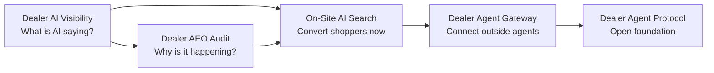

# DealershipMCP commercial site architecture

Status: implemented September 4, 2026.

## Page hierarchy

```text
DealershipMCP commercial home (/)
├── Dealer AI Visibility (/visibility/)
│   ├── Free visibility checker (dealeraivisibility.com)
│   └── Dealer AEO Audit (dealeraeoaudit.com)
├── On-Site AI Search (/ai-search/)
├── Dealer Agent Gateway (/gateway/)
│   ├── Inventory sources (/inventory-sources/)
│   ├── Connect a dealer (/connect/)
│   └── Open implementation (dealeragentgateway.com)
├── Live pilot evidence (/live/)
├── Free diagnostic paths (/audit/)
├── How it works (/how-it-works/)
├── Compare standards (/compare/)
├── Privacy (/privacy/)
└── Terms (/terms/)
```

## Commercial journey



## Navigation

Primary navigation is deliberately outcome-based:

1. AI Visibility
2. AI Search
3. Agent Gateway
4. Live pilot
5. Rightmost CTA: free visibility check or pilot request

Technical implementation, legal, comparison, contribution, and protocol links
remain available through contextual links and the footer rather than competing
with the dealer-facing product story in the primary navigation.

## Internal linking

- The homepage links directly to all three product pages and both acquisition domains.
- Visibility routes to the free checker, deeper AEO audit, AI Search, and Gateway.
- AI Search routes backward to visibility and forward to the Gateway/pilot form.
- Gateway routes to live evidence, source architecture, and the open protocol.
- Live evidence routes to the public Howard Bentley status and authority policy.
- Every primary product remains within one click of the homepage.
